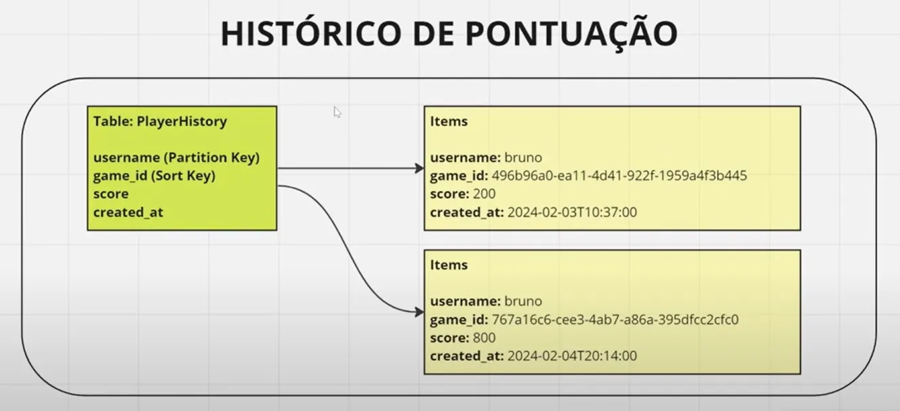

# DynamoDB CRUD com Spring Boot

Aplicação Spring Boot que implementa um CRUD completo para DynamoDB utilizando LocalStack para desenvolvimento local.

## Tecnologias

- **Spring Boot** - Framework principal
- **Spring Cloud AWS** - Integração com AWS
- **DynamoDB** - Banco NoSQL
- **LocalStack** - Ambiente AWS local

## Estrutura

A aplicação gerencia um histórico de pontuação de jogadores com a seguinte estrutura:

**Tabela: PlayerHistory**
- `username` (Partition Key)
- `game_id` (Sort Key)
- `score`
- `created_at`

## Configuração

### 1. Iniciar LocalStack
```bash
docker run -p 4566:4566 localstack/localstack
```

### 2. Executar aplicação
```bash
./mvnw spring-boot:run
```

## Funcionalidades

- ✅ Criar registro de pontuação
- ✅ Buscar histórico por usuário
- ✅ Atualizar pontuação
- ✅ Deletar registro
- ✅ Listar todos os registros

## Vantagens

- **Desenvolvimento local** - Sem dependência da AWS
- **Sem custos** - Testes gratuitos com LocalStack
- **Produtividade** - Desenvolvimento mais rápido
- **Isolamento** - Ambiente dedicado para testes

## Estrutura do Projeto

```
src/
├── main/java/
│   ├── config/     # Configurações DynamoDB
│   ├── model/      # Entidades
│   ├── repository/ # Repositórios
│   └── controller/ # Controllers REST
```

---

*Desenvolvido com Spring Boot + DynamoDB + LocalStack*

